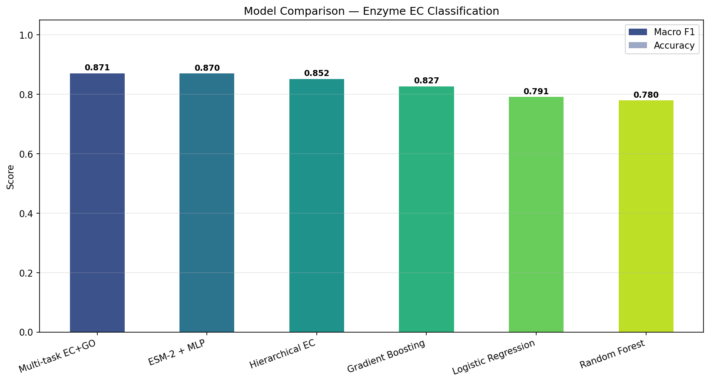

# ESM-2 for Enzyme Function Prediction

Fine-tuning and benchmarking Meta's ESM-2 protein language model for **Enzyme Commission (EC) number prediction** from amino acid sequences.

## Motivation

Accurate enzyme function prediction is critical for drug discovery, metabolic engineering, and understanding disease mechanisms. UniProt contains 245M+ protein sequences, but fewer than 0.1% have experimentally validated functional annotations. This project benchmarks multiple machine learning approaches using ESM-2 protein language model embeddings to predict enzyme function from sequence alone, inspired by hierarchical prediction methods such as DEEPre (Li et al., 2018).

## Approach

```
UniProt SwissProt (reviewed enzymes) + GO annotations
        │
        │  Filter: EC level 1, seq ≤ 1022 residues
        ▼
  Dataset (~8,000-9,000 sequences, 6 EC classes + GO labels)
        │
        ├──→ ESM-2 Embedding Extraction (frozen)
        │     • Mean-pooled (default)
        │     • Attention-pooled (learned residue weighting)
        │           │
        │           ├── Logistic Regression (baseline)
        │           ├── Random Forest
        │           ├── Gradient Boosting
        │           ├── MLP Classifier
        │           └── Residual MLP
        │
        ├──→ Hierarchical EC Classifier (DEEPre-inspired)
        │     • Level 1: main class (EC 1-6)
        │     • Level 2: subclass per class
        │
        └──→ Multi-task EC + GO Model
              • Primary: EC classification (6 classes)
              • Auxiliary: GO term prediction (multi-label)
```

## EC Classes (Task)

| Class | Name | Function |
|-------|------|----------|
| EC1 | Oxidoreductases | Catalyze oxidation/reduction reactions |
| EC2 | Transferases | Transfer functional groups |
| EC3 | Hydrolases | Hydrolysis reactions |
| EC4 | Lyases | Non-hydrolytic bond cleavage |
| EC5 | Isomerases | Structural rearrangement |
| EC6 | Ligases | Bond formation coupled with ATP |

## Results

Test set: 1,350 sequences (15% holdout), 225 per EC class. Dataset: 9,000 Swiss-Prot enzymes, 1,500 per class.

### Flat Classification

| Model | Accuracy | Macro F1 |
|-------|----------|----------|
| Logistic Regression | 0.7919 | 0.7913 |
| Random Forest | 0.7793 | 0.7796 |
| Gradient Boosting | 0.8267 | 0.8270 |
| ESM-2 + MLP | 0.8696 | 0.8694 |
| ESM-2 + Residual MLP | - | - |

### Hierarchical & Multi-task

| Model | EC Main-Class F1 | EC Subclass | Notes |
|-------|------------------|-------------|-------|
| Hierarchical EC | - | - | Level-by-level (DEEPre-inspired) |
| Multi-task EC+GO | - | GO F1 micro: - | EC + GO auxiliary head |

*Run `python scripts/run_pipeline.py --train` to regenerate with updated models.*

*ESM-2 + MLP: 480-dim frozen embeddings from `esm2_t12_35M_UR50D`, mean-pooled, then a 2-hidden-layer MLP (256→128) with BatchNorm + Dropout.*


Figures: [confusion matrix](results/figures/confusion_matrix.png) · [training curves](results/figures/training_curves.png) · [dataset overview](results/figures/dataset_overview.png)

## Key Findings

1. Frozen ESM-2 embeddings alone capture enough functional signal for enzyme EC classification — even a linear classifier reaches **79.2% macro F1**
2. A simple 2-hidden-layer MLP on frozen embeddings reaches **86.9% macro F1**, outperforming classical ML baselines by 4-9 points
3. The residual confusions are biologically meaningful: EC6 (Ligases) is classified most reliably (F1 0.93), while EC3/EC4 (Hydrolases/Lyases) are hardest to separate
4. A frozen-embedding pipeline is a strong, training-light baseline for main-class EC prediction — natural next step is extending to EC subclasses and benchmarking against hierarchical models like DEEPre on shared benchmarks

## Project Structure

```
ESM-2/
├── data/
│   ├── download_data.py       # UniProt REST API download (incl. GO annotations)
│   ├── enzymes_swissprot.csv  # Raw dataset with GO terms
│   ├── esm2_embeddings.npy    # Pre-extracted embeddings (mean-pooled)
│   └── labels.npy             # Class labels
├── src/
│   ├── embeddings.py          # ESM-2 embedding extraction (mean + attention pooling)
│   ├── models.py              # MLP, Residual MLP, Hierarchical EC, Multi-task EC+GO, sklearn baselines
│   ├── train.py               # Training pipeline (flat, hierarchical, multi-task)
│   └── visualize.py           # Publication-quality figures
├── notebooks/
│   └── exploration_colab.ipynb  # Self-contained Colab notebook
├── scripts/
│   └── run_pipeline.py        # One-click full pipeline
├── results/
│   ├── figures/               # Generated plots
│   └── experiment_results.json
├── requirements.txt
└── README.md
```

## Quick Start

```bash
# Install dependencies
pip install -r requirements.txt

# Option 1: Run full pipeline
python scripts/run_pipeline.py

# Option 2: Run step by step
python data/download_data.py               # Download data (includes GO annotations)
python src/embeddings.py                    # Extract embeddings (~30 min on GPU)
python src/train.py                         # Train + evaluate all models
python src/visualize.py                     # Generate figures

# Attention pooling variant
python scripts/run_pipeline.py --embeddings --pooling attention
```

## Running on Google Colab (Recommended)

For GPU access, upload **`notebooks/exploration_colab.ipynb`** to Google Colab and run all cells. It is fully self-contained — no project files or imports needed:

## Hardware Requirements

- **Data download**: CPU only, ~10 minutes
- **Embedding extraction**: GPU recommended (Colab T4 works), ~30-60 minutes
- **Training**: CPU or GPU, ~5-10 minutes (hierarchical + multi-task adds ~5 minutes)

## Future Directions

- [ ] **End-to-end ESM-2 fine-tuning**: Unfreeze ESM-2 layers with low learning rate and train jointly with classification head
- [ ] **Low-homology evaluation**: Split test set by sequence identity (CD-HIT) to evaluate generalization on orphan/low-homology sequences
- [ ] **Direct DEEPre benchmark comparison**: Evaluate on DEEPre's published test sets (NEW and DD datasets) for direct comparison
- [ ] **Attention visualization**: Visualize residue-level attention weights to identify functionally critical positions

## References

- Lin et al. "Evolutionary-scale prediction of atomic-level protein structure with a language model." *Science* (2023)
- The UniProt Consortium. "UniProt: the Universal Protein Knowledgebase." *Nucleic Acids Research* (2023)
- Li et al. "DEEPre: sequence-based enzyme EC number prediction by deep learning." *Bioinformatics* (2018)

## Author

Mohammed Abdul Aziz
ISL Engineering College, Hyderabad
Email: mohammedabduljunaid007@gmail.com

**Forked and extended by:** 
Ahmed Mairaj Baig
ISL Engineering College, Hyderabad
ambaig.dev@gmail.com
- Added hierarchical EC prediction, multi-task EC+GO, and attention pooling
- Updated the UniProt download pipeline with GO annotations

The base classifier and pipeline are original work by M. Abdul Aziz and Ahmed Mairaj Baig; this fork extends it with the additional models above.

## License

MIT
